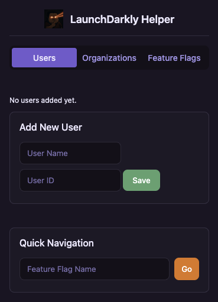

# LaunchDarkly Helper

<div align="center">
  
</div>

<div align="center">
  
</div>

A Chrome extension to streamline your LaunchDarkly workflow by managing user and organization IDs for feature flag targeting.

## Features

- **Store User IDs**: Save user IDs with friendly names for quick access
- **Store Organization IDs**: Save organization IDs with names for quick access
- **Apply IDs**: Quickly apply saved IDs to LaunchDarkly's feature flag targeting fields
- **Flag Navigation**: Jump directly to specific feature flags
- **History Tracking**: Automatically tracks and stores your 30 most recently visited feature flags

## How to Use

### Managing User/Org IDs

1. **Add User IDs**:
   - Go to the "Users" tab
   - Enter a name and user ID
   - Click "Save"

2. **Add Organization IDs**:
   - Go to the "Organizations" tab
   - Enter a name and organization ID
   - Click "Save"

3. **Apply IDs to Feature Flags**:
   - Navigate to any LaunchDarkly feature flag settings page
   - Click the extension icon in Chrome toolbar
   - Find the user or org you want to target
   - Click "Apply" next to the ID
   - The extension will click the "Edit" button and fill in the ID automatically

### Feature Flag Navigation

1. **Quick Navigation**:
   - Enter a feature flag name in the "Quick Navigation" field
   - Click "Go" or press Enter
   - A new tab will open with that feature flag's settings

2. **Recent Flags**:
   - Go to the "Feature Flags" tab
   - View a list of your recently visited flags
   - Select a flag and click "Go to Selected" or double-click on it
   - The extension automatically tracks flags you visit

## Installation

### From Source

1. **Clone the repository**:
   ```
   git clone https://github.com/yourusername/LaunchDarklyHelper.git
   ```
   Or download and extract the ZIP file from GitHub

2. **Load the extension in Chrome**:
   - Open Chrome and navigate to `chrome://extensions/`
   - Enable "Developer mode" using the toggle in the top-right corner
   - Click "Load unpacked"
   - Select the `LaunchDarklyHelper` folder

3. **Pin the extension** (optional):
   - Click the puzzle piece icon in Chrome's toolbar
   - Find "LaunchDarkly Helper" and pin it for easy access

## Usage Tips

- The extension will automatically track feature flags you visit and add them to your recent flags list
- You can clear your flag history by clicking "Clear History" in the Feature Flags tab
- The extension works on any page under `https://app.launchdarkly.com/*`
- You can delete saved user/org IDs by clicking the "Delete" button next to them

## Important Note - Safety Limitations

**What this extension does NOT do:**
- It does NOT automatically enable or toggle feature flags
- It does NOT automatically add targeting rules beyond filling in IDs
- It does NOT make changes to flag settings without user interaction

These limitations are intentional safety features to prevent accidental changes that could cause production issues. The extension only assists with navigation and form-filling to reduce manual work, but all actual targeting decisions and flag activation require explicit user action in the LaunchDarkly interface.

## About

This extension was created to streamline workflows when working with LaunchDarkly feature flags. It helps you quickly navigate to flags and apply user/organization targeting without manual copying and pasting of IDs.

## Privacy

The LaunchDarkly Helper extension:
- Stores all data locally in your browser using Chrome's secure storage
- Does not transmit any data outside your browser
- Only runs on LaunchDarkly pages (`https://app.launchdarkly.com/*`)
- Only requires minimal permissions necessary for its functionality